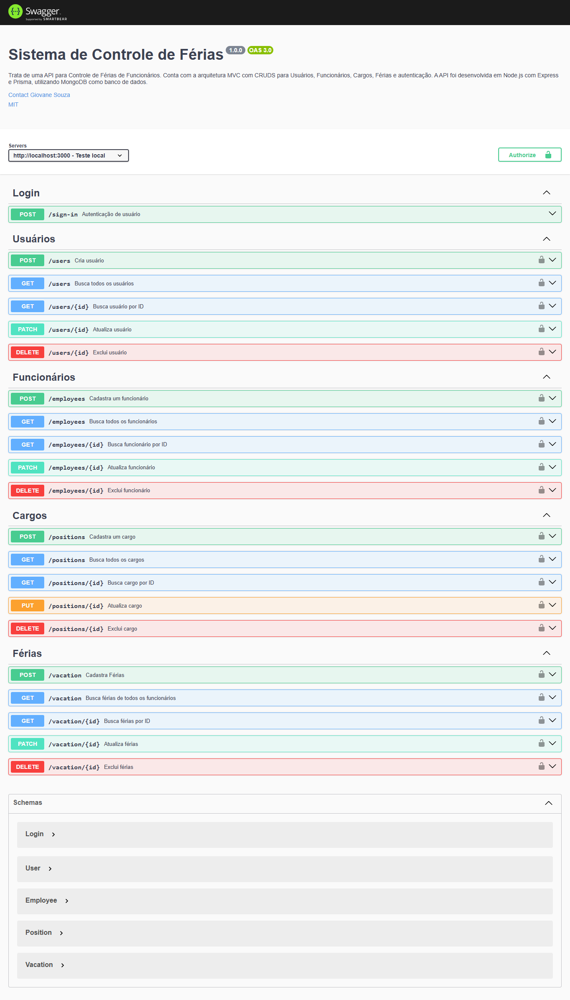

# API para Controle de Férias

## ℹ️ Sobre

Trata de uma API para Controle de Férias para uma empresa parceira, `realizado como parte de atividades extensionistas (PEX) em alinhamento com o Objetivo de Desenvolvimento Sustentável (ODS) 8 da ONU`: **"Trabalho decente e crescimento econômico"**. **O projeto teve como foco proporcionar melhorias na organização e gestão dos recursos humanos, promovendo práticas mais eficientes, transparentes e sustentáveis no ambiente de trabalho**.
O sistema foi desenvolvido utilizando tecnologias de código aberto e plataformas gratuitas, visando acessibilidade e sustentabilidade financeira para a organização.

> Projeto desenvolvido como parte avaliativa da disciplina `PROJETO DE EXTENSÃO V`, do curso de `ADS`.


## 💻 Tecnologias e ferramentas utilizadas


## 📝 Pré-requesitos para testar a API localmente

Antes de utilizar o projeto, certifique-se de seguir as seguintes etapas:

- [x] **Ter o git instalado na máquina;**
- [x] **Ter o Node instalado;**
- [x] **Ter um banco de dados NoSQL local ou CLOUD**;
- [x] **Ter um editor de código de sua preferência**;
- [x] **Clonar o repositório por meio do comando abaixo**:

  ```shell
  git clone https://github.com/giovanesouza/posto-br-rh-backend.git
  ```

## ⚙️ Configurações necessárias

> Com o repositório clonado, execute os comandos abaixo (no diretório do projeto):

- **Para baixar as dependências**: `npm install`;
- **Crie um arquivo com o nome** `.env`, insira nele o código que está no arquivo `.env.example` e insira os valores nas chaves.

  1. **DATABASE_URL**: você precisará substituir os valores - `<USER>` (usuário do BD), senha do usuário `<DB_PASSWORD>`, Cluster `<cluster>` e o nome do banco `<PROJECT_NAME>`.
  1. **PORT**: defina a porta onde a aplicação irá rodar.
  1. **CORS_ORIGIN_URL**: defina quem poderá acessar a aplicação.
  1. **SECRET_JWT**: modifique a chave fornecida por outra de sua preferência.
  

- **Esquemas do banco de dados**: após inserção das chaves no `.env`, incluindo a conexão com o BD, execute o comando `npx prisma migrate dev`.
- **Rode o projeto utilizando o comando** `npm start`

## 🌐 Métodos aceitos

- **GET**: Para listagem de registro(s).
- **POST**: Para criação de novo(s) registro(s).
- **PUT**: Para atualização de registro(s) existente(s) - `total`.
- **PATCH**: Para atualização de registro(s) existente(s) - `parcial`.
- **DELETE**: Para exclusão de registro(s).

## 🔗 Endpoints

### Autenticação

- **POST `/sign-in`**: Realiza o login de um usuário.

### Usuários

- **POST `/users`**: Cria um novo usuário.
- **GET `/users`**: Retorna todos os usuários cadastrados.
- **GET `/users/:id`**: Retorna um usuário específico pelo ID.
- **PATCH `/users/:id`**: Atualiza `username` e `password`.
- **DELETE `/users/:id`**: Exclui um usuário pelo ID.

### Funcionários

- **POST `/employees`**: Cria um novo funcionário.
- **GET `/employees`**: Retorna todos os funcionários cadastrados. Pode ser adicionado um parâmetro do tipo query para **filtragem** de funcionários **por nome**: `/employees`**?name=VALOR**.
- **GET `/employees/:id`**: Retorna um funcionário específico pelo ID.
- **PATCH `/employees/:id`**: Atualiza funcionário.
- **DELETE `/employees/:id`**: Exclui um funcionário pelo ID.

### Cargos

- **POST `/positions`**: Cria um novo cargo.
- **GET `/positions`**: Retorna todos os cargos cadastrados.
- **GET `/positions/:id`**: Retorna um cargo específico pelo ID.
- **PUT `/positions/:id`**: Atualiza cargo.
- **DELETE `/positions/:id`**: Exclui um cargo pelo ID.

### Férias

- **POST `/vacation`**: Cria férias.
- **GET `/vacation`**: Retorna todas as férias cadastradas - todos os funcionários.
- **GET `/vacation/:id`**: Retorna um registro específico pelo ID.
- **PATCH `/vacation/:id`**: Atualiza férias.
- **DELETE `/vacation/:id`**: Exclui um registro pelo ID.


## 🎲 Estruturas de dados

```prisma
model User {
  id         String    @id @default(uuid()) @map("_id")
  username   String    @unique
  password   String
  employeeId String?   @unique
  employee   Employee? @relation(fields: [employeeId], references: [id])
  isAdmin    Boolean   @default(false)

  @@map("users")
}

model Employee {
  id                String     @id @default(uuid()) @map("_id")
  positionId        String?
  name              String
  cpf               String     @unique
  admissionDate     DateTime
  isPendingVacation Boolean    @default(false)
  createdAt         DateTime   @default(now())
  updatedAt         DateTime   @updatedAt
  position          Position?  @relation(fields: [positionId], references: [id])
  vacations         Vacation[]
  user              User?

  @@map("employees")
}

model Position {
  id           String     @id @default(uuid()) @map("_id")
  positionName String
  cbo          String     @unique
  employees    Employee[]

  @@map("positions")
}

model Vacation {
  id             String   @id @default(uuid()) @map("_id")
  employeeId     String
  isVacationSold Boolean  @default(false)
  soldDays       Int      @default(0)
  startDate      DateTime
  endDate        DateTime
  createdAt      DateTime @default(now())
  updatedAt      DateTime @updatedAt
  employee       Employee @relation(fields: [employeeId], references: [id])

  @@map("vacations")
}
```


## 📖 Documentação Swagger

Após inicializar a aplicação (`npm start`), você pode utilizar a documentação **Swagger** para realizar testes por meio dos `endpoints` disponíveis, além de consultar todos os `schemas`. Para tanto, acesse o endpoint a seguir: `http://localhost:3000/api-docs`.




## 🧪 Testes Automatizados 🆕

O projeto agora conta com uma suite de testes automatizados utilizando `Jest` + `Supertest`, garantindo maior segurança, qualidade e confiabilidade no comportamento da API.

### 🧰 O que foi testado?

- **Login**
  - Validações de campos obrigatórios
  - Retorno apropriado para credenciais válidas e inválidas
- **Usuários**
  - Criação
  - Login
  - Busca por ID
  - Atualização parcial
  - Erros esperados (ex.: duplicidade)
- **Funcionários**
  - Criação
  - Listagem
  - Filtro por nome
  - Atualização
  - Validações de campos obrigatórios
- **Cargos**
  - CRUD completo
  - Validação de CBO duplicado
- **Férias**
  - Regra de férias vendidas
  - Data inicial obrigatória
  - Geração automática de data final
  - Casos de erro e sucesso

### ▶️ Como rodar os testes?

Antes, configure o `.env.test`.

Em seguida, execute:

```bash
npm test
```